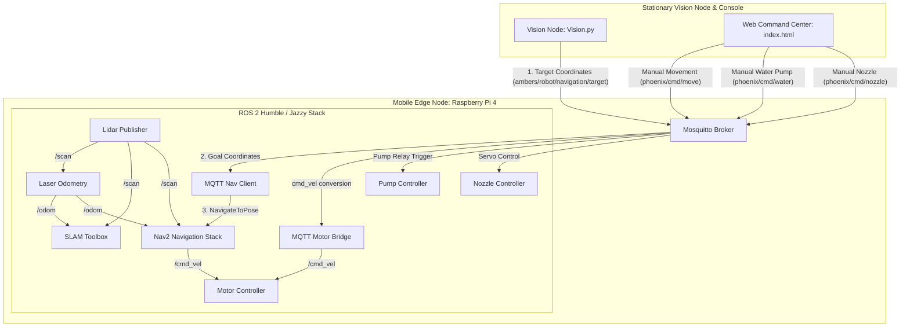

# Phoenix Robot

Intelligent Mobile Robot for autonomous flame detection and manual fire suppression. This repository utilizes a split-node architecture, distributing tasks across a stationary **Vision Node** (Laptop), a **Web Command Center** (Operator Console), and the physical **Mobile Edge Node** (Raspberry Pi 4).

The system has transitioned from simulation to physical edge deployment. All simulation world and display launch files have been removed, configuring the workspace exclusively for real-world operations with laser-scan-based odometry (`rf2o_laser_odometry`), dynamic SLAM, Nav2, and web-based manual override controls.

---

## 🏗️ System Architecture



---

## 📡 MQTT Topic Reference

The system utilizes a local **Mosquitto MQTT Broker** (port `1883` for ROS 2 nodes, and WebSocket port `9001` for the Web Dashboard) for latency-free communication:

| Topic | Publisher | Subscriber | Commands / Payload | Purpose |
| :--- | :--- | :--- | :--- | :--- |
| `phoenix/cmd/move` | Web Dashboard | `mqtt_motor_bridge` | `FORWARD`, `BACKWARD`, `LEFT`, `RIGHT`, `STOP` | Manual drive overrides |
| `phoenix/cmd/water` | Web Dashboard | `pump_controller` | `ON`, `OFF` | Hold-to-spray water pump activation |
| `phoenix/cmd/nozzle` | Web Dashboard | `nozzle_controller` | `LEFT`, `RIGHT`, `UP`, `DOWN`, `STOP`, `CENTER` | Continuous panning & step tilting |
| `ambers/robot/navigation/target` | Vision Node | `mqtt_nav_client` | `{"x": float, "y": float}` | Auto navigation goal to detected flame |
| `ambers/robot/status` | `mqtt_nav_client` | Vision Node | `{"status": string}` | Navigation status telemetry |

---

## 📂 Project Structure

```
phoenix_robot/
├── ambers_ws/                  # ROS 2 Workspace (Pi 4)
│   └── src/
│       ├── phoenix_control/    # Hardware and MQTT bridge nodes
│       └── phoenix_description/# URDF, transforms, and navigation configs
├── vision_node/                # Laptop Vision Stack (Custom PyTorch Flame Model + Fall/Human Keras Models + ArUco)
├── Phoenix_Web_Command_Center/ # Operator Control Dashboard (HTML5 / Vanilla CSS / JS)
├── Local_MQTT/                 # Local Mosquitto MQTT broker configuration
├── scripts/                    # Automation and utility scripts
├── runs/                       # Output logs and system run records
├── docs/                       # Research documents & project reports
├── phoenix_run_guide.md        # Comprehensive execution and setup guide
├── speed_calculations.md       # Math and theory behind robot speed and gear ratio
└── README.md                   # Main documentation (this file)
```

---

## 🚀 Quick Start (Operation Summary)

For a complete step-by-step setup walkthrough including MQTT configs and wiring, see the detailed **[Phoenix Execution & Mission Guide](file:///c:/Users/basse/OneDrive - King Salman International University/Graduation Project/phoenix_robot/phoenix_run_guide.md)**.

### 1. Build and Prepare (Raspberry Pi)
Verify that helper scripts are executable:
```bash
chmod +x scripts/*.sh
```
Build the workspace using the helper script:
```bash
./scripts/build.sh
```

### 2. Vision Node Setup (Laptop)
Ensure Python 3.8+ is installed:
```bash
cd vision_node
pip install -r requirements.txt
python Vision.py
```

### 3. Launching Robot Nodes
Open individual SSH terminal windows on the Raspberry Pi and execute the following:
* **Terminal 1 (Lidar):** `ros2 run phoenix_control lidar_publisher`
* **Terminal 2 (Laser Odom):** `ros2 launch phoenix_description laser_odom.launch.py`
* **Terminal 3 (SLAM):** `ros2 launch slam_toolbox online_async_launch.py slam_params_file:=/home/ambers/ambers_ws/src/phoenix_description/config/mapper_params_online_async.yaml use_sim_time:=False`
* **Terminal 4 (Nav2):** `ros2 launch nav2_bringup navigation_launch.py use_sim_time:=False`
* **Terminal 5 (Motors):** `ros2 run phoenix_control motor_controller`
* **Terminal 6 (Nav Client):** `ros2 run phoenix_control mqtt_nav_client`
* **Terminal 7 (Pump Node):** `ros2 run phoenix_control pump_controller`
* **Terminal 8 (Nozzle Node):** `ros2 run phoenix_control nozzle_controller`
* **Terminal 9 (Pi Camera):** `bash ~/ambers_ws/scripts/start_pi_camera_stream.sh`
* **Terminal 10 (Web Bridge):** `ros2 run phoenix_control mqtt_motor_bridge`

### 4. Open Web Command Center
1. Open [index.html](file:///c:/Users/basse/OneDrive%20-%20King%20Salman%20International%20University/Graduation%20Project/phoenix_robot/Phoenix_Web_Command_Center/index.html) in any modern browser.
2. Under the **Settings** tab, configure the **Broker WS** to `ws://<PI_IP>:9001/mqtt` (replace `<PI_IP>` with your Pi's actual IP).
3. Connect and switch to **Manual** mode to pilot the robot and operate the suppression actuators.

---

## 🚒 How the Mission Works
1. **Flame Detection:** The stationary `Vision.py` uses a custom-trained PyTorch model (and HSV fallback for smaller candle flames) to recognize fire, alongside Keras models for Human and Fall detection. It projects pixel coordinates to 3D navigation targets using ArUco marker references.
2. **Autonomous Travel:** Targets are dispatched to `mqtt_nav_client`, sending a Goal Pose to Nav2. The robot navigates autonomously using real-time Laser Odometry and the SLAM-built costmap.
3. **Safe Distance Arrival:** Once within `0.3m` (30cm) of the candle, navigation halts and locks.
4. **Manual Suppression:** The operator uses the **Web Command Center** to command the continuous panning/tilting nozzle servos and activate the 24V water pump relay using the hold-to-spray interface to extinguish the flame.