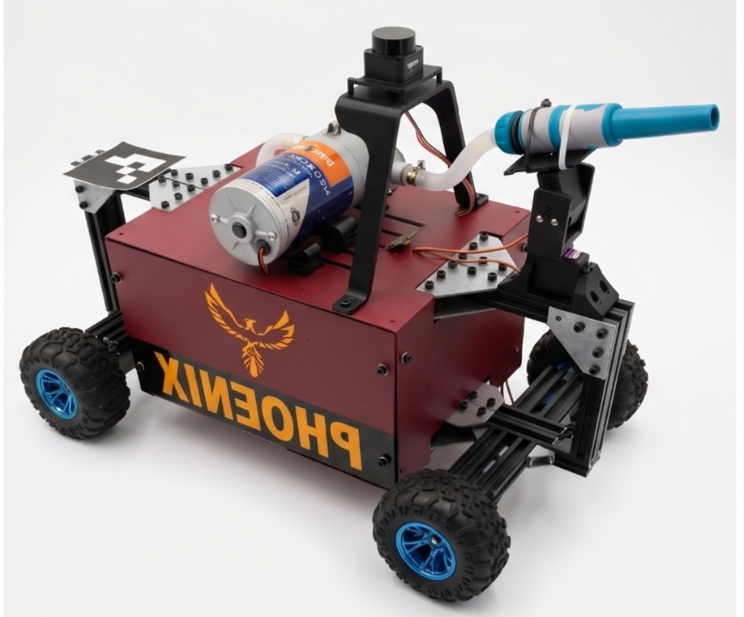
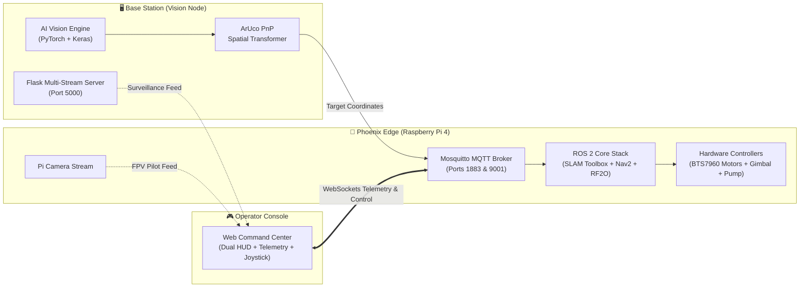

<p align="center">
  
</p>

<h1 align="center">PHOENIX ROBOT</h1>

<p align="center">
  <strong>Autonomous AI Fire-Seeking, Hazard Assessment & Precision Suppression Mobile Robot</strong>
</p>

<p align="center">
  <a href="https://docs.ros.org/en/humble/"></a>
  <a href="https://pytorch.org/"></a>
  <a href="https://www.tensorflow.org/"></a>
  <a href="https://navigation.ros.org/"></a>
  <a href="https://mosquitto.org/"></a>
  <a href="https://www.ksiu.edu.eg/"></a>
</p>

---

## 🌟 Product Overview

**Phoenix** is an enterprise-grade autonomous emergency response robot engineered to detect, locate, and suppress indoor fire hazards while conducting real-time search-and-rescue casualty assessment. 

Combining an off-board **AI Perception Engine**, an on-board **ROS 2 Navigation & SLAM Edge Computer**, and a browser-based **Cybernetic Operator Command Center**, Phoenix bridges the gap between fully autonomous hazard seeking and fail-safe human-in-the-loop tactical intervention.

<p align="center">
  
</p>

---

## 🎬 Mission Demonstration

<p align="center">
  <video src="assets/Phoenix_Demo.mp4" controls="controls" width="100%" style="max-width: 800px; border-radius: 8px;">
    <source src="assets/Phoenix_Demo.mp4" type="video/mp4">
    Your browser does not support the video tag.
  </video>
</p>

<p align="center">
  <a href="assets/Phoenix_Demo.mp4">▶️ <strong>Watch Full Phoenix Demonstration Video (Phoenix_Demo.mp4)</strong></a>
</p>

> 📹 **Demonstration Highlights:** Full autonomous emergency response sequence — featuring real-time AI flame detection, fallen casualty localization, dynamic Nav2 obstacle avoidance with RF2O odometry, and 2-DOF precision suppression.

---

## 🚀 Key Capabilities

### 🔥 AI Fire & Flame Seeking
* **Custom PyTorch Deep Learning Classifier:** Real-time flame recognition resistant to smoke and environmental light shifts.
* **Micro-Flame Chromatic Verification:** High-precision HSV color segmentation and morphological aspect ratio filtering designed to isolate small flame sources (such as candles).
* **ArUco Spatial Projection:** Solves the Perspective-n-Point (PnP) geometry to translate camera pixel centroids into millimeter-accurate metric navigation coordinates in the arena ground plane.

### 👤 Search & Rescue Life Detection
* **Human Presence Recognition:** Keras deep learning model continuously surveying the arena for personnel.
* **Fall & Casualty Identification:** Dedicated neural classifier detecting non-upright or incapacitated individuals, raising immediate emergency priority status on the operator HUD.

### 🧭 Slip-Resistant Autonomous Navigation
* **`rf2o_laser_odometry`:** Continuous planar laser scan odometry that overcomes the severe wheel slip typical of 4-wheel skid-steer chassis.
* **Dynamic SLAM & Costmaps:** SLAM Toolbox asynchronous mapping paired with Nav2 global and local costmaps for obstacle avoidance.
* **Safe Standoff Distance:** Enforces an automatic $0.30\text{ m}$ ($30\text{ cm}$) standoff lock, shielding robot hardware from flame contact.

### 💦 2-DOF Pan-Tilt Suppression Turret
* **Precision Aiming Gimbal:** 360° continuous horizontal panning (GPIO 19) and 180° vertical tilt trimming (GPIO 13) with automatic idle detachment to eliminate jitter and save power.
* **24V High-Pressure Water Cannon:** Optically isolated relay driving a self-priming diaphragm pump delivering targeted water suppression.
* **Hold-to-Spray Interlock:** Fail-safe tactile trigger preventing accidental water discharge or tank depletion.

### 🎮 Zero-Latency Web Command Center
* **Dual-Stream Tactical HUD:** Real-time side-by-side surveillance view (with neural bounding boxes and tracking vectors) and forward-facing robot FPV stream.
* **Instant Mode Switching:** Effortlessly switch between full **Autonomous Mode** and low-latency **Manual Override**.
* **Zero-Install Client:** Powered by MQTT over WebSockets (`ws://<PI_IP>:9001/mqtt`), running in any modern desktop or mobile browser.

---

## 🏗️ High-Level System Architecture



---

## ⚙️ Technical Specifications

| Parameter | Specification |
| :--- | :--- |
| **Chassis Dimensions** | $465\text{ mm (L)} \times 355\text{ mm (W)} \times 200\text{ mm (H)}$ |
| **Total Weight** | $\approx 5.4\text{ kg}$ (Including batteries and suppression reservoir) |
| **Drive Configuration**| 4-Wheel Skid-Steer / Differential Drive |
| **Locomotion Motors** | 4x 12V DC High-Torque Gear Motors ($300\text{ RPM}$) driven by 2x BTS7960 ($43\text{A}$) |
| **Edge Compute** | Raspberry Pi 4 Model B (4GB / 8GB RAM, Quad-Core Cortex-A72 @ 1.5GHz) |
| **LiDAR Sensor** | Okdo LD06 TOF (360° scanning, $12\text{ m}$ radius, $4500\text{ Hz}$ sample frequency) |
| **Visual Sensors** | Robot Pi Camera (FPV) + TP-Link Tapo C200 1080p (Surveillance & AI tracking) |
| **Suppression Pump** | 24V DC High-Pressure Diaphragm Pump (Self-Priming) |
| **Gimbal Turret** | 2-DOF ($360^\circ$ Continuous Yaw + $180^\circ$ Positional Pitch) |
| **Power Distribution**| 12V Li-ion (Drive Motors) + 24V Li-ion (Pump) + 5V/3A UBEC (Edge Logic) |
| **Software Stack** | ROS 2 (Humble/Jazzy), PyTorch, TensorFlow, OpenCV, Paho MQTT, Flask |

---

## 🚒 Mission Workflow

```
[ 1. AI Hazard Detection ]  ──►  Overhead camera detects flame centroid & checks for casualties
           │
[ 2. Metric Projection ]   ──►  ArUco PnP solver projects pixel (u, v) into arena coordinate (X, Y)
           │
[ 3. Target Dispatch ]     ──►  MQTT publishes target coordinate to ambers/robot/navigation/target
           │
[ 4. Autonomous Nav ]      ──►  Nav2 plans collision-free path using rf2o laser odometry & SLAM
           │
[ 5. Standoff Lock ]       ──►  Robot halts at 0.30m safe distance from fire and signals operator
           │
[ 6. Precision Extinguish ] ──►  Operator directs pan-tilt turret and triggers 24V suppression spray
```

---

## ⚡ Quickstart Guide

### 1. Build Edge Workspace (Raspberry Pi 4)
```bash
chmod +x scripts/*.sh
./scripts/build.sh
```

### 2. Launch Unified Robot Stack (Raspberry Pi 4)
```bash
export ROS_DOMAIN_ID=30
source ambers_ws/install/setup.bash
ros2 launch phoenix_description phoenix_bringup.launch.py
```

### 2a. Run Full Mission in Simulation (Gazebo Harmonic)

The repository includes a complete Gazebo Harmonic simulation environment with full Web Command Center and MQTT integration:

```bash
# 1. Install prerequisites & CycloneDDS (recommended for WSL2/Linux inter-process DDS)
sudo apt update
sudo apt install -y python3-paho-mqtt python3-gpiozero ros-jazzy-rmw-cyclonedds-cpp mosquitto mosquitto-clients
echo "export RMW_IMPLEMENTATION=rmw_cyclonedds_cpp" >> ~/.bashrc
source ~/.bashrc

# 2. Build and launch simulation stack
source /opt/ros/$ROS_DISTRO/setup.bash
cd ambers_ws
colcon build --symlink-install
source install/setup.bash

# Launch High-Fidelity Datacenter Environment (Recommended for Demos & Competitions)
ros2 launch phoenix_description simulation.launch.py world_type:=datacenter pro_model:=true

# Or Launch High-Bay Warehouse Logistics Environment
# ros2 launch phoenix_description simulation.launch.py world_type:=warehouse pro_model:=true

# Or Launch Hands-Free Automated Competition Demo Run (6-Stage Autonomous Response)
# ros2 launch phoenix_description simulation.launch.py world_type:=datacenter pro_model:=true run_demo:=true
```

* **Datacenter & Warehouse Worlds:** High-density 42U server racks with activity LEDs, cold-aisle containment, crash cart obstacle, technician casualty, and burning UPS server fire, or high-bay warehouse pallet storage racking with cargo hazards.
* **Phoenix Pro Model:** High-fidelity robot mesh with anodized Deep Crimson livery, Sky-Blue wheels, 2020 aluminum arch, and 2-DOF suppression nozzle.
* **Fully Integrated:** Bridges LiDAR (`/scan`), odometry (`/odom`), driving (`/cmd_vel`), camera (`/camera/image_raw`), and clock (`/clock`).
* **Web HUD Ready:** Automatically launches MQTT control bridges (`mqtt_nav_client`, `mqtt_motor_bridge`, `pump_controller`, `nozzle_controller`) with simulation time enabled (`use_sim_time:=True`).
* **Automated Competition Demo:** See [assets/Phoenix_Demo.mp4](assets/Phoenix_Demo.mp4) for the recorded 6-stage autonomous run executing obstacle avoidance and suppression.
* **18-Second Nav2 Stabilization:** Nav2 automatically launches 18 seconds after Gazebo to let SLAM Toolbox stabilize the `map -> odom` transform before costmaps activate.

In a second terminal, after sourcing the workspace, dispatch a map-frame goal (or use the Web Command Center D-Pad / Goal sender):

```bash
ros2 action send_goal /navigate_to_pose nav2_msgs/action/NavigateToPose \
  "{pose: {header: {frame_id: map}, pose: {position: {x: 2.0, y: 1.5}, orientation: {w: 1.0}}}}"
```

Useful telemetry checks:

```bash
ros2 topic hz /scan
ros2 topic hz /odom
ros2 topic hz /camera/image_raw
ros2 run tf2_tools view_frames
ros2 topic echo /map --once
```

> 📖 *For detailed step-by-step guidance including Mosquitto WebSocket setup and manual D-Pad driving instructions, see [docs/phoenix_run_guide.md](docs/phoenix_run_guide.md).*

### 3. Launch AI Vision Engine (Laptop / Workstation)
```bash
cd vision_node
pip install -r requirements.txt
python Vision.py
```

### 4. Connect Web Command Center (Browser)
1. Open `Phoenix_Web_Command_Center/index.html` in your browser.
2. In **⚙ Settings**, choose your target preset:
   - Click **Local Sim (9001)** for Gazebo simulation (`ws://localhost:9001/mqtt`).
   - Click **Robot Pi (Live)** for the physical robot (`ws://<PI_IP>:9001/mqtt`).
3. Click **⚡ CONNECT TO BROKER**.
4. Switch to **MANUAL** mode to drive via D-Pad, test water suppression, or direct the nozzle.

---

## 📚 Technical Documentation Index

For deep architectural analyses, math models, and hardware references, explore the dedicated documentation modules:

| Documentation Module | Description |
| :--- | :--- |
| 🏗️ [System Architecture & Topology](docs/system_architecture.md) | Split-node topology, ROS 2 DDS graph, TF2 tree, and MQTT schemas |
| 👁️ [AI Vision & Spatial Perception](docs/ai_vision_pipeline.md) | PyTorch flame CNN, Keras life detection models, and ArUco 3D PnP projection |
| 🧭 [Navigation, SLAM & Motor Control](docs/navigation_and_control.md) | Nav2 stack, SLAM Toolbox online async mapping, RF2O laser odometry & BTS7960 drivers |
| 🚒 [Suppression Actuators & Gimbal](docs/suppression_actuators.md) | 2-DOF Pan-Tilt gimbal mechanics, 24V pump relay, and hold-to-spray safety |
| 🎮 [Web Command Center & HUD](docs/web_command_center.md) | Operator HUD layout, telemetry gauges, dual-camera streaming & virtual controls |
| 🔌 [Hardware Specifications & Wiring](docs/hardware_and_wiring.md) | Bill of materials, complete Raspberry Pi GPIO pinout table, and power distribution |
| 🚀 [Phoenix Run & Execution Guide](docs/phoenix_run_guide.md) | Step-by-step terminal execution, networking, and manual debugging runbook |
| 📐 [Speed & Kinematics Calculations](docs/speed_calculations.md) | Mathematical formulas and physical factors for skid-steer speed estimation |
| 🎨 [Brand Identity & Design System](docs/theme.md) | Cybernetic Ember color palette, tokens, logo variations, and UI styling |
| 💻 [Useful CLI Commands](docs/useful_commands.md) | Hardware diagnostics, topic echo, and selective package build commands |

---

## 👥 Project Team & Acknowledgments

Developed as the Senior Graduation Capstone Project (**IRFFLD - Intelligent Robot for Fire Fighting and Life Detection**) at **King Salman International University (KSIU)**.

### Team AMBERS:
* **Bassel Elbahnasy** (Lead Robotics & AI Engineering)
* **Amin**
* **Ebrahim**
* **Hamsa**
* **Yousef ElSaket**

---

<p align="center">
  <sub>Built with passion for emergency robotics and autonomous life-saving systems.</sub>
</p>