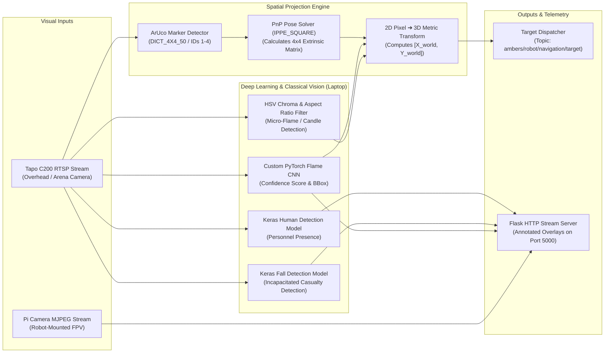

# 👁️ AI Vision & Spatial Perception Pipeline

The **Phoenix Robot Vision System** provides continuous multi-camera scene understanding, fusing deep learning neural networks with geometric computer vision to detect fire hazards, locate trapped casualties, and compute millimeter-accurate navigation targets.

---

## 🧠 Perception Pipeline Architecture



---

## 🔥 Fire & Flame Detection Suite

The system implements a dual-tiered detection strategy combining a deep Convolutional Neural Network (CNN) with a specialized high-speed chromatic analyzer:

### 1. Custom PyTorch Flame CNN (`fire_detection_model.pt`)
* **Architecture:** Multi-stage convolutional feature extractor utilizing batch normalization, ReLU non-linearities, spatial max-pooling, and dropout regularization.
* **Input Resolution:** $224 \times 224 \times 3$ normalized tensor.
* **Trained On:** Extensive fire and hazard datasets under varying ambient lighting conditions, smoke occlusions, and reflections.
* **Output:** Binary classification confidence $[0.0, 1.0]$ with dynamic probability thresholding.

### 2. High-Precision HSV & Morphological Analyzer (Candle / Small Flame Detection)
To detect small flame sources (such as isolated candle flames in test arenas) that might not fill sufficient receptive fields in a CNN, the pipeline runs an optimized color-space analyzer:
* **Color Filtering:** Converts BGR frames to the HSV color space and isolates characteristic fire hues:
  $$\text{Hue} \in [1, 18], \quad \text{Saturation} \in [180, 255], \quad \text{Value} \in [200, 255]$$
* **Aspect Ratio Verification:** Enforces a vertical aspect ratio constraint ($\text{Height} > \text{Width}$), filtering out horizontal reflections, amber lights, or gold decals on the robot chassis.
* **Morphological Noise Suppression:** Applies Gaussian blurring ($5 \times 5$ kernel) and morphological opening/closing operations to eliminate single-pixel sensor noise.

---

## 👤 Life & Casualty Detection Suite

Phoenix incorporates search-and-rescue capabilities to identify human occupants and emergency fall scenarios:

### 1. Human Presence Classifier (`Human_Detection/human.h5`)
* **Framework:** Keras / TensorFlow deep neural network.
* **Function:** Continuously scans the surveillance visual feed to identify standing or moving human figures.
* **Alert Trigger:** Categorizes scene occupancy and transmits real-time alerts to the operator HUD.

### 2. Fall / Casualty Detection Engine (`Fall_Detection/fall_detection_scratch.h5`)
* **Framework:** Custom Keras model optimized for non-upright body poses.
* **Function:** Differentiates between upright individuals and incapacitated or fallen persons.
* **Emergency Response:** Immediately tags the fallen individual's coordinates, elevating mission alert level to `CRITICAL HAZARD` on the Web Command Center.

---

## 📐 ArUco Spatial Transformation & 3D Projection

To translate a 2D bounding box from a stationary surveillance camera into metric navigation coordinates ($x, y$ in meters) relative to the robot's coordinate frame, Phoenix employs an ArUco-based PnP (Perspective-n-Point) solver.

```
       Camera Optical Center [C]
              /       \
             /         \
            /           \
     [Pixel (u, v)]   [ArUco Target (X_r, Y_r)]
          |                  |
    Flame Centroid     Robot Chassis Reference
```

### 1. Marker Detection & Pose Estimation
* **Dictionary:** `DICT_4X4_50` (Physical marker size $L = 0.10\text{ m} = 10\text{ cm}$).
* **Detector:** `cv2.aruco.ArucoDetector` with sub-pixel corner refinement.
* **PnP Solver:** Uses `cv2.solvePnP` with the `SOLVEPNP_IPPE_SQUARE` flag to compute the rotation vector $\mathbf{r}$ and translation vector $\mathbf{t}$ between the camera frame and the robot chassis marker:

$$\begin{bmatrix} X_c \\ Y_c \\ Z_c \end{bmatrix} = \mathbf{R} \begin{bmatrix} X_m \\ Y_m \\ Z_m \end{bmatrix} + \mathbf{t}$$

### 2. Coordinate Transformation Matrix
The rotation vector is converted via the Rodrigues transform into a $3 \times 3$ rotation matrix $\mathbf{R}$, forming the $4 \times 4$ homogeneous transformation matrix $\mathbf{T}$:

$$\mathbf{T}_{camera}^{world} = \begin{bmatrix} R_{11} & R_{12} & R_{13} & t_x \\ R_{21} & R_{22} & R_{23} & t_y \\ R_{31} & R_{32} & R_{33} & t_z \\ 0 & 0 & 0 & 1 \end{bmatrix}$$

### 3. Ray-Plane Intersection & Target Dispatch
1. The detected flame centroid $(u_f, v_f)$ in pixel space is unprojected through the camera intrinsic matrix $\mathbf{K}^{-1}$ to form a 3D ray in camera coordinates.
2. The ray is intersected with the arena ground plane ($Z_{world} = 0$).
3. The resulting metric coordinates $(X_{flame}, Y_{flame})$ are packaged into a JSON payload:
   ```json
   {
     "x": 1.45,
     "y": 0.82
   }
   ```
4. Dispatched immediately via MQTT topic `ambers/robot/navigation/target`.

---

## 📡 Live Stream Distribution (Flask Multi-Threaded Server)

The stationary vision node hosts a Flask web server on port `5000` supporting concurrent MJPEG HTTP streaming:
* **`/video_feed_tapo`**: Broadcasts the overhead surveillance feed with rendered bounding boxes, flame tracking vectors, ArUco coordinate frames, and casualty status tags.
* **`/video_feed_pi`**: Relays the robot's forward-facing Pi Camera FPV stream for suppression aiming.
* **CORS Support:** `flask_cors.CORS` is enabled, permitting direct embedding into the Web Command Center dashboard across local networks.
