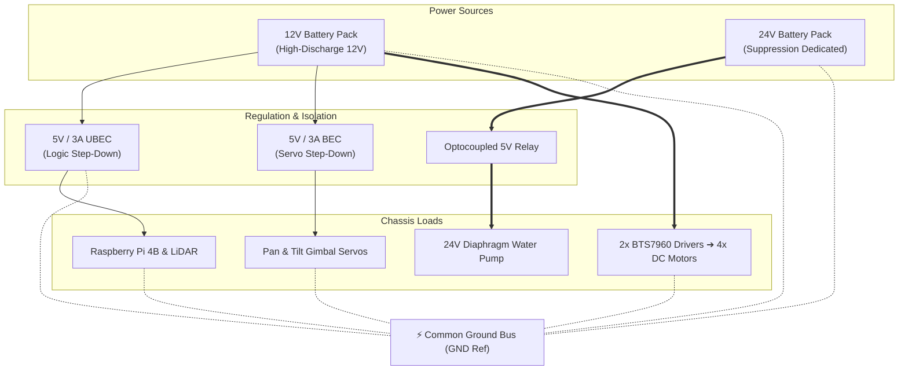

# 🔌 Hardware Specifications & Wiring Guide

This document outlines the complete Bill of Materials (BOM), Raspberry Pi 4 GPIO pin assignment matrix, and electrical power distribution topology for the **Phoenix Robot**.

---

## 📋 Bill of Materials (BOM)

| Component Category | Item Description | Model / Specification | Purpose |
| :--- | :--- | :--- | :--- |
| **Edge Compute** | Single Board Computer | Raspberry Pi 4B (4GB / 8GB) | ROS 2 Edge Stack, Controllers & Broker |
| **Stationary Compute**| Base Station / Laptop | Intel Core i7 / NVIDIA GPU / Mac M-Series | Real-Time AI Vision & Web Dashboard |
| **Laser Sensor** | 2D LiDAR Scanner | Okdo LD06 TOF (12m range, 360°, 4500Hz) | SLAM Mapping & `rf2o` Laser Odometry |
| **Vision Sensors** | FPV Camera | Raspberry Pi Camera Module | Low-latency forward stream for suppression |
| **Surveillance Camera**| Arena IP Camera | TP-Link Tapo C200 (1080p RTSP Stream) | Global hazard & life detection feed |
| **Motor Drivers** | Dual High-Current H-Bridge | 2x BTS7960 43A Motor Drivers | PWM speed control for 4WD DC motors |
| **Locomotion** | High-Torque DC Motors | 4x 12V DC Gear Motors (300 RPM) | Skid-steer all-terrain mobile platform |
| **Suppression Pump** | High-Pressure Water Pump | 24V DC Diaphragm Pump (Self-Priming) | Extinguishing water jet delivery |
| **Relay Driver** | Isolated Relay Module | 1-Channel 5V Optocoupler Relay | Safe 24V pump power switching |
| **Gimbal Servos** | Horizontal Pan Actuator | 360° Continuous Rotation Servo | Continuous horizontal nozzle panning |
| **Gimbal Servos** | Vertical Tilt Actuator | 180° Standard Positional Servo | Vertical nozzle pitch adjustment |
| **Power Distribution**| Main Drive Battery | 12V Li-ion / Lead-Acid Battery Pack | Motors & chassis locomotion |
| **Power Distribution**| Pump Battery | 24V Li-ion Battery Pack (or 2x12V Series)| High-pressure water pump |
| **Voltage Regulation**| Step-Down Buck Converters | 2x LM2596 / UBEC (12V ➔ 5V @ 3A) | Clean 5V for Pi 4 & Servos |

---

## 📌 Raspberry Pi 4 GPIO Pinout Matrix

```
                          Raspberry Pi 4 Header
                             +3.3V [01] [02] +5V (Relay VCC)
              (I2C SDA)    GPIO 02 [03] [04] +5V (LiDAR VCC)
              (I2C SCL)    GPIO 03 [05] [06] GND (LiDAR GND)
                           GPIO 04 [07] [08] GPIO 14 (UART TX)
                            Ground [09] [10] GPIO 15 (LiDAR PWM / UART RX)
     Left Motor RPWM ───►  GPIO 17 [11] [12] GPIO 18 (LiDAR Data TX) ◄─── LiDAR TX
     Left Motor LPWM ───►  GPIO 27 [13] [14] Ground
    Right Motor LPWM ───►  GPIO 22 [15] [16] GPIO 23 (Right Motor LPWM)
                           +3.3V   [17] [18] GPIO 24
    Right Motor RPWM ───►  GPIO 10 [19] [20] Ground
                           GPIO 09 [21] [22] GPIO 25 (Right Motor RPWM) ◄── Right FWD
                           GPIO 11 [23] [24] GPIO 08
                            Ground [25] [26] GPIO 07
                           GPIO 00 [27] [28] GPIO 01
       Pump Relay IN ───►  GPIO 05 [29] [30] Ground
                           GPIO 06 [31] [32] GPIO 12
         Tilt Servo  ───►  GPIO 13 [33] [34] Ground
          Pan Servo  ───►  GPIO 19 [35] [36] GPIO 16
       Pump Relay IN ───►  GPIO 26 [37] [38] GPIO 20
                            Ground [39] [40] GPIO 21
```

### Pin Assignment Summary

| Function | Pin Name | Physical Header Pin | Connection Target |
| :--- | :--- | :--- | :--- |
| **LiDAR Power** | `+5V` | Pin 4 | LD06 VCC (Blue Wire) |
| **LiDAR Ground**| `GND` | Pin 6 | LD06 GND (Red Wire) |
| **LiDAR Data** | `GPIO 18` (RXD0) | Pin 12 | LD06 TX (Yellow Wire) |
| **LiDAR Motor** | `GPIO 15` (TXD0) | Pin 10 | LD06 PWM (White Wire) |
| **Left Motor FWD** | `GPIO 17` (RPWM)| Pin 11 | Left BTS7960 RPWM |
| **Left Motor REV** | `GPIO 27` (LPWM)| Pin 13 | Left BTS7960 LPWM |
| **Right Motor FWD**| `GPIO 25` (RPWM)| Pin 22 | Right BTS7960 RPWM |
| **Right Motor REV**| `GPIO 23` (LPWM)| Pin 16 | Right BTS7960 LPWM |
| **Nozzle Pan Servo**| `GPIO 19` (PWM)| Pin 35 | 360° Continuous Servo Signal |
| **Nozzle Tilt Servo**| `GPIO 13` (PWM)| Pin 33 | 180° Positional Servo Signal |
| **Water Pump Relay**| `GPIO 26` | Pin 37 | 5V Relay Module `IN` Pin |

---

## ⚡ Electrical Power Topology



> [!IMPORTANT]
> **Common Ground Rule:** All ground reference lines (Raspberry Pi GND, 12V Battery GND, 24V Battery GND, and 5V Buck Converter GNDs) must be connected to a central **Common Ground Bus**. This prevents floating logic signals and ensures clean PWM switching.
