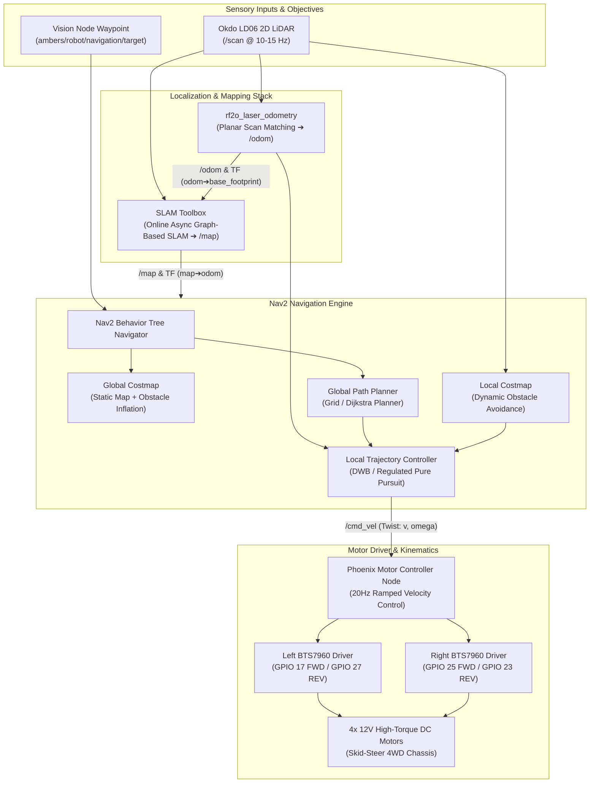

# 🧭 Navigation, SLAM & Motor Control Stack

The **Phoenix Autonomous Navigation Stack** integrates 2D SLAM, laser-based odometry, ROS 2 Nav2 path planning, and dual BTS7960 motor controllers to ensure precise, slip-resistant mobility across complex indoor environments.

---

## 🏎️ Navigation & Control Architecture



---

## 🗺️ Real-Time SLAM & Odometry Pipeline

### 1. Odometry Duality & TF Stability
Traditional wheel encoders or open-loop dead reckoning in 4-wheel skid-steer robots suffer from 40–70% odometric drift caused by lateral wheel slippage during turns. Phoenix solves this through clean architectural separation:

* **On Physical Hardware:**
  - `laser_odom.launch.py` runs **RF2O (Range Flow-based 2D Odometry)** from LiDAR `/scan`.
  - Publishes `/odom` and broadcasts dynamic TF `odom` $\rightarrow$ `base_footprint`.
  - In `motor_controller.py`, `publish_odom_tf` is set to `False` (default), completely eliminating TF fighting and map distortion.
* **In Gazebo Harmonic Simulation:**
  - The Gazebo `DiffDrive` system plugin simulates physics-based wheel contact and publishes `/odom`.
  - The [`simulation_odom_tf`](file:///d:/Phoenix/ambers_ws/src/phoenix_control/phoenix_control/simulation_odom_tf.py) node listens to `/odom` and broadcasts dynamic TF `odom` $\rightarrow$ `base_footprint` with simulation timestamp sync.

### 2. SLAM Toolbox (Online Asynchronous Mapping)
* **Mode:** `online_async_launch.py` configured via `mapper_params_online_async.yaml`.
* **Graph Optimization:** Builds a high-resolution 2D occupancy grid map (`/map`, resolution $0.05\text{ m/cell}$) in real time while performing continuous loop closure.
* **TF Broadcast:** Computes and broadcasts the transform `map` $\rightarrow$ `odom`.

---

## 🎯 Nav2 Path Planning & Action Client

### 1. `TimerAction` Startup Synchronization
Launching Nav2 simultaneously with SLAM Toolbox causes global costmap initialization failures because the TF chain `map` $\rightarrow$ `odom` $\rightarrow$ `base_footprint` is not yet connected at $t=0$. Both [simulation.launch.py](file:///d:/Phoenix/ambers_ws/src/phoenix_description/launch/simulation.launch.py) (20s delay) and [phoenix_bringup.launch.py](file:///d:/Phoenix/ambers_ws/src/phoenix_description/launch/phoenix_bringup.launch.py) (15s delay) wrap `nav2_launch` inside a `TimerAction` to ensure 100% reliable costmap initialization.

### 2. `mqtt_nav_client` Action Bridge
The `mqtt_nav_client` node bridges MQTT target coordinates to the ROS 2 Action Server:
1. Receives `{ "x": float, "y": float, "frame_id": "map" }` from `ambers/robot/navigation/target`.
2. Calculates heading orientation towards the hazard and formats a `geometry_msgs/msg/PoseStamped` goal.
3. Dispatches the goal to the Nav2 `NavigateToPose` action server.
4. Broadcasts live navigation status (`NAVIGATING`, `SUCCEEDED`, `REJECTED`, `FAILED`) to `phoenix/status` and `ambers/robot/status`.

### 3. Stand-Off Distance & Safe Arrival Logic
* To prevent the robot from colliding with the fire source or exposing its chassis to high radiant heat, the goal waypoint is calculated with a **0.30 m (30 cm) standoff offset**.
* Once the action server reports `STATUS_SUCCEEDED`, navigation locks, `target_reached` is triggered, and the water suppression spray activates automatically or on manual command.

### 4. Multi-Channel Waypoint Dispatch
Waypoints can be dispatched to Nav2 through three synchronized interfaces:
1. **Interactive Web Minimap & Presets:** Click-to-navigate on the Web Command Center 2D arena canvas, sending JSON payloads to `ambers/robot/navigation/target`.
2. **RViz2 3D "2D Goal Pose" Tool:** Point-and-click directly in 3D on the SLAM occupancy grid (`/goal_pose`).
3. **ROS 2 Action CLI:** Direct terminal dispatch via `ros2 action send_goal /navigate_to_pose nav2_msgs/action/NavigateToPose`.

---

## ⚡ Motor Controller & Kinematics Engine

The robot uses a 4-wheel skid-steer (differential drive equivalent) chassis powered by high-torque DC gear motors and driven by two high-current BTS7960 H-Bridge driver modules.

```
       [Front Left Wheel] ========= [Front Right Wheel]
               |                            |
          (Left BTS7960)              (Right BTS7960)
         GPIO 17 / GPIO 27           GPIO 25 / GPIO 23
               |                            |
       [Rear Left Wheel]  ========= [Rear Right Wheel]
```

### 1. Differential Drive Kinematics
Given target linear velocity $v$ and target angular velocity $\omega$:

$$V_{left} = v - \left(\frac{\omega \cdot W}{2}\right), \qquad V_{right} = v + \left(\frac{\omega \cdot W}{2}\right)$$

Where $W = 0.355\text{ m}$ represents the robot's track width.

### 2. Dynamic Acceleration Ramping
To protect mechanical gearboxes and prevent high-current inductive spikes on the 12V power rail, `motor_controller.py` implements rate-limiting velocity smoothing:
* **Control Loop Frequency:** $20\text{ Hz}$ ($\Delta t = 0.05\text{ s}$).
* **Linear Step Limit:** $\Delta v_{max} = 0.2\text{ m/s}$ per tick ($4.0\text{ m/s}^2$ max acceleration).
* **Angular Step Limit:** $\Delta \omega_{max} = 0.5\text{ rad/s}$ per tick ($10.0\text{ rad/s}^2$ max angular acceleration).

### 3. Failsafe Timeout
The motor controller maintains a 500ms command heartbeat watchdog. If no `/cmd_vel` message is received within $0.5\text{ s}$, motor outputs are immediately clamped to zero duty cycle.
