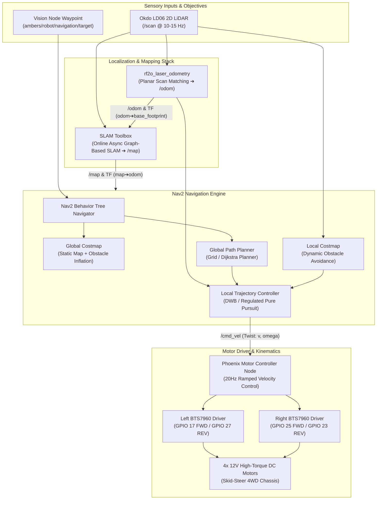

# 🧭 Navigation, SLAM & Motor Control Stack

The **Phoenix Autonomous Navigation Stack** integrates 2D SLAM, laser-based odometry, ROS 2 Nav2 path planning, and dual BTS7960 motor controllers to ensure precise, slip-resistant mobility across complex indoor environments.

---

## 🏎️ Navigation & Control Architecture



---

## 🗺️ Real-Time SLAM & Odometry Pipeline

### 1. `rf2o_laser_odometry` (Planar Laser Odometry)
Traditional wheel encoders in 4-wheel skid-steer robots suffer from substantial odometric drift caused by wheel slippage and lateral friction during turns. Phoenix solves this by employing **RF2O (Range Flow-based 2D Odometry)**:
* **Principle:** Estimates robot planar motion by analyzing consecutive 2D laser scans from the Okdo LD06 LiDAR using the range flow constraint equation.
* **Benefits:** 100% immune to wheel spin, wheel slip, carpet drag, or battery-induced torque fluctuations.
* **Output:** Publishes continuous `/odom` telemetry and broadcasts the real-time dynamic transform `odom` $\rightarrow$ `base_footprint`.

### 2. SLAM Toolbox (Online Asynchronous Mapping)
* **Mode:** `online_async_launch.py` configured via `mapper_params_online_async.yaml`.
* **Graph Optimization:** Builds a high-resolution 2D occupancy grid map (`/map`, resolution $0.05\text{ m/cell}$) in real time while performing continuous loop closure.
* **TF Broadcast:** Computes and broadcasts the transform `map` $\rightarrow$ `odom`.

---

## 🎯 Nav2 Path Planning & Action Client

### 1. `mqtt_nav_client` Action Bridge
The `mqtt_nav_client` node bridges MQTT target coordinates to the ROS 2 Action Server:
1. Receives `{ "x": float, "y": float }` from `ambers/robot/navigation/target`.
2. Converts the coordinate into a `geometry_msgs/msg/PoseStamped` goal frame in the `map` coordinate frame.
3. Dispatches the goal to the Nav2 `NavigateToPose` action server.
4. Monitors path progress and reports status back to `ambers/robot/status`.

### 2. Stand-Off Distance & Safe Arrival Logic
* To prevent the robot from colliding with the fire source or exposing its chassis to high radiant heat, the goal waypoint is calculated with a **0.30 m (30 cm) standoff offset**.
* Once the action server reports `STATUS_SUCCEEDED`, navigation locks, and the operator is prompted on the Web Command Center to initiate manual or semi-automated suppression.

---

## ⚡ Motor Controller & Kinematics Engine

The robot uses a 4-wheel skid-steer (differential drive equivalent) chassis powered by high-torque DC gear motors and driven by two high-current BTS7960 H-Bridge driver modules.

```
       [Front Left Wheel] ========= [Front Right Wheel]
               |                            |
          (Left BTS7960)              (Right BTS7960)
         GPIO 17 / GPIO 27           GPIO 25 / GPIO 23
               |                            |
       [Rear Left Wheel]  ========= [Rear Right Wheel]
```

### 1. Differential Drive Kinematics
Given target linear velocity $v$ and target angular velocity $\omega$:

$$V_{left} = v - \left(\frac{\omega \cdot W}{2}\right), \qquad V_{right} = v + \left(\frac{\omega \cdot W}{2}\right)$$

Where $W = 0.355\text{ m}$ represents the robot's track width.

### 2. Dynamic Acceleration Ramping
To protect mechanical gearboxes and prevent high-current inductive spikes on the 12V power rail, `motor_controller.py` implements rate-limiting velocity smoothing:
* **Control Loop Frequency:** $20\text{ Hz}$ ($\Delta t = 0.05\text{ s}$).
* **Linear Step Limit:** $\Delta v_{max} = 0.2\text{ m/s}$ per tick ($4.0\text{ m/s}^2$ max acceleration).
* **Angular Step Limit:** $\Delta \omega_{max} = 0.5\text{ rad/s}$ per tick ($10.0\text{ rad/s}^2$ max angular acceleration).

### 3. Failsafe Timeout
The motor controller maintains a 500ms command heartbeat watchdog. If no `/cmd_vel` message is received within $0.5\text{ s}$, motor outputs are immediately clamped to zero duty cycle.
