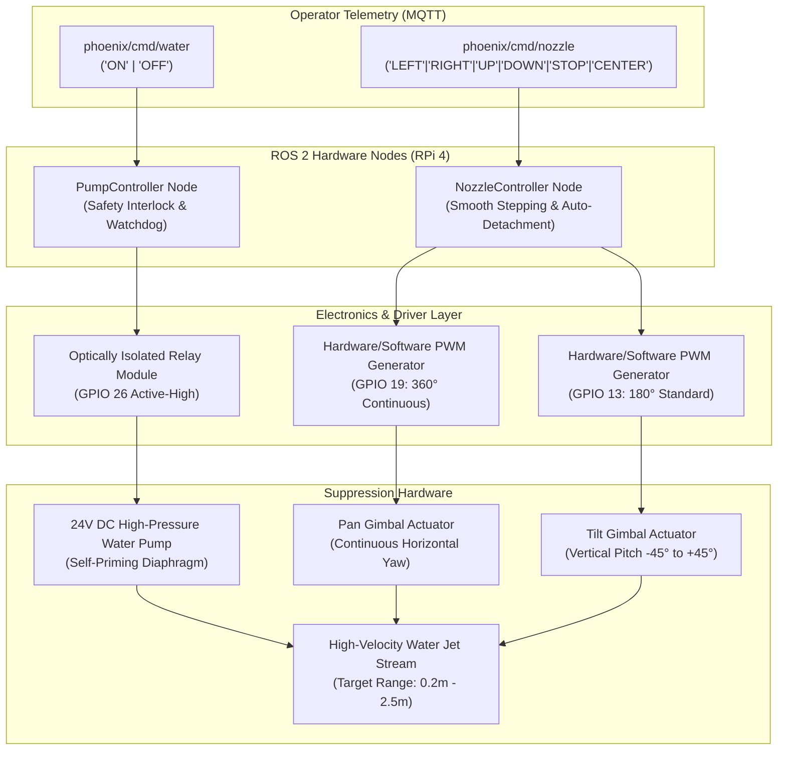

# 🚒 Fire Suppression & Gimbal Actuator Mechanics

The **Phoenix Suppression Subsystem** provides precision targeting and rapid extinguishing capabilities via a 2-Axis (Pan-Tilt) robotic nozzle turret and an optically isolated 24V high-pressure diaphragm water pump.

---

## 🎯 Suppression Actuator Architecture



---

## 🕹️ 2-DOF Pan-Tilt Gimbal Mechanism

The nozzle gimbal provides continuous horizontal scanning and vertical pitch trimming to accurately direct the suppression jet at the flame base:

| Dimension | Actuator Type | Control Pin | Pulse Range | Motion Profile |
| :--- | :--- | :--- | :--- | :--- |
| **Horizontal (Pan)** | 360° Continuous Servo | `GPIO 19` | $500\,\mu\text{s} - 2500\,\mu\text{s}$ | Directional velocity ($v_{pan} = \pm 0.3$) |
| **Vertical (Tilt)** | 180° Positional Servo | `GPIO 13` | $500\,\mu\text{s} - 2500\,\mu\text{s}$ | Smooth step interpolation ($\Delta \theta = 0.02/\text{tick}$) |

### 1. Jitter Elimination & Idle Auto-Detachment
Standard hobby servos tend to experience thermal drift and audible buzzing when holding static positions under load. `nozzle_controller.py` implements a smart **auto-detachment protocol**:
* Whenever no pan or tilt command is received, PWM pulses are disengaged (`detach()`), allowing the motor to rest coolly without unnecessary battery drain or jitter.
* The moment a movement command (`LEFT`, `RIGHT`, `UP`, `DOWN`) is registered, PWM signals re-engage instantaneously.

### 2. Zero-Centering Routine
When commanded with `CENTER`, the gimbal executes an automatic re-alignment sequence:
* Sets vertical tilt angle to neutral ($0.0$ / horizontal level).
* Halts continuous horizontal panning.

---

## 💧 24V High-Pressure Water Suppression System

```
  +24V Battery Rail ──────[ Relay Switch (GPIO 26) ]────── ( + ) 24V Diaphragm Pump
                                                                    │
  Reservoir Tank ─────────[ Suction Tube ]──────────────────────────┘
                                                                    │
                                   [ Reinforced Hose ] ─────────────┘
                                           │
                                [ Gimbal Jet Nozzle ] ───► Extinguishing Stream
```

### 1. Electrical & Relay Isolation
* **Control Pin:** `GPIO 26` (Active-High).
* **Isolation:** The relay board incorporates optocoupler galvanic isolation, keeping the $24\text{ V}$ inductive switching noise completely isolated from the Raspberry Pi's $3.3\text{ V}$ logic core.

### 2. Hold-to-Spray Safety Protocol
* Suppression is triggered via the MQTT topic `phoenix/cmd/water`.
* The Web Command Center enforces a **tactile hold-to-spray** mechanism:
  - **Press / Hold:** Dispatches payload `"ON"` $\rightarrow$ Relay closes $\rightarrow$ Water sprays.
  - **Release / Pointer Leave:** Dispatches payload `"OFF"` $\rightarrow$ Relay opens $\rightarrow$ Water immediately stops.
* This fail-safe architecture prevents accidental reservoir depletion or water damage in the operational environment.
