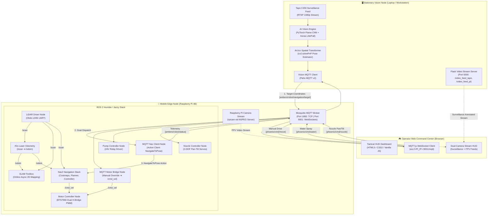
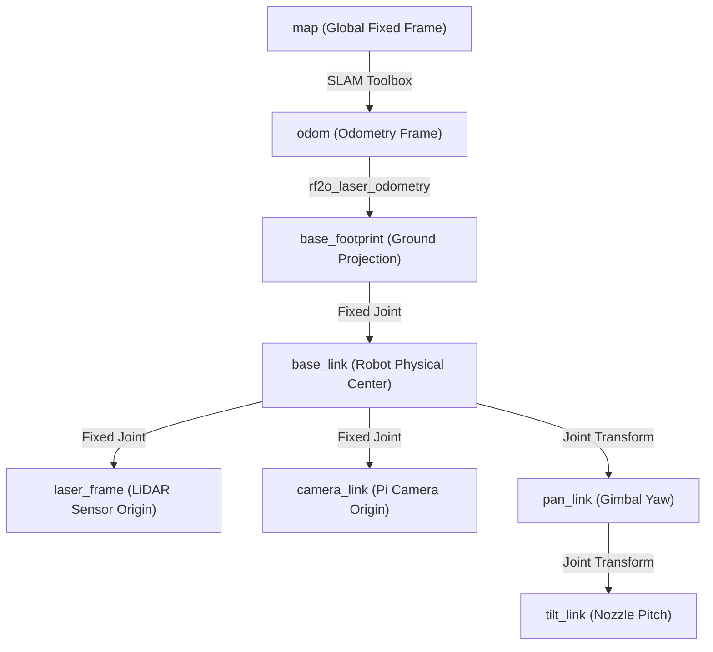

# 🏗️ System Architecture & Distributed Node Topology

The **Phoenix Robot** is architected on a distributed, three-tier compute model designed to maximize real-time edge performance while leveraging off-board compute for intensive computer vision and centralized mission oversight.

---

## 🌐 Distributed Topology Overview

---

## 📦 Core Compute Nodes

### 1. Stationary Vision Node (Laptop / Base Station)
* **High-Throughput Perception:** Runs heavy convolutional neural networks (PyTorch & TensorFlow/Keras) for simultaneous fire detection, human presence detection, and fall/casualty recognition.
* **Spatial Calibration:** Tracks the robot's real-time position and orientation within the global arena via an ArUco marker array mounted to the robot's chassis.
* **Coordinate Projection:** Translates 2D bounding boxes in camera pixel coordinates to metric 3D arena coordinates, publishing navigation waypoints to the robot.
* **Stream Transcoding:** Hosts a lightweight Flask multi-threaded HTTP server (port `5000`) broadcasting annotated MJPEG video feeds.

### 2. Mobile Edge Node (Raspberry Pi 4B)
* **Autonomous Navigation:** Executes the complete ROS 2 robotics stack including 2D SLAM, laser odometry, global/local costmaps, and trajectory planners.
* **Hardware Actuation:** Direct GPIO hardware interface driving high-current BTS7960 motor bridges, high-pressure pump relays, and precision pan-tilt servos.
* **Central Broker:** Runs the local Mosquitto MQTT message broker serving both native TCP connections (ROS 2 nodes) and WebSocket clients (Web Dashboard).
* **FPV Video Server:** Streams high-definition, low-latency video directly from the robot-mounted Pi Camera.

### 3. Operator Web Command Center (Browser Console)
* **Single-Pane-of-Glass HUD:** Provides real-time mission telemetry, navigation feedback, active fire alerts, and dual-camera monitoring.
* **Instant Manual Override:** Grants the operator fine-grained manual control over drive motors, nozzle gimbal orientation, and water suppression activation.
* **Zero-Install Client:** Runs entirely in any standard modern web browser with zero local dependencies using MQTT over WebSockets.

---

## 📡 MQTT Topic Specification & Message Payloads

The communication backbone uses Mosquitto MQTT for lightweight, low-latency telemetry and command transport:

| Topic | Publisher | Subscriber | Payload Format | Description |
| :--- | :--- | :--- | :--- | :--- |
| `phoenix/cmd/move` | Web Console | `mqtt_motor_bridge` | String: `FORWARD` \| `BACKWARD` \| `LEFT` \| `RIGHT` \| `STOP` | Manual drive control override |
| `phoenix/cmd/water` | Web Console | `pump_controller` | String: `ON` \| `OFF` | Hold-to-spray 24V water pump relay trigger |
| `phoenix/cmd/nozzle` | Web Console | `nozzle_controller` | String: `LEFT` \| `RIGHT` \| `UP` \| `DOWN` \| `STOP` \| `CENTER` | 2-DOF Pan-Tilt servo positioning |
| `ambers/robot/navigation/target` | Vision Node | `mqtt_nav_client` | JSON: `{"x": float, "y": float}` | Flame navigation target coordinate (meters) |
| `ambers/robot/status` | `mqtt_nav_client` | Vision Node / Web Console | JSON: `{"status": string}` | Mission status (`NAVIGATING`, `TARGET_REACHED`, `IDLE`) |

---

## 🧭 Coordinate Transforms & TF2 Tree

The robot maintains a standard ROS 2 transform tree to ensure spatial consistency across laser scan matching, odometry, and navigation planning:

### Key Reference Frames:
* **`map`**: The global static coordinate frame established by SLAM Toolbox during initial mapping.
* **`odom`**: The continuous, drift-compensated odometry frame generated by `rf2o_laser_odometry`.
* **`base_footprint`**: 2D ground projection of the robot body.
* **`base_link`**: Center of mass of the robot chassis ($465\text{ mm} \times 355\text{ mm} \times 200\text{ mm}$).
* **`laser_frame`**: Optical center of the Okdo LD06 LiDAR sensor.

---

## 🔐 Safety & Failsafe Mechanisms

1. **Deadman Safety Watchdog:** In manual mode, directional movement commands automatically time out if no update is received within 500ms, preventing runaway robot behavior.
2. **Hold-to-Spray Interlock:** Water suppression requires an active, continuous press on the trigger; releasing the button immediately de-energizes the 24V pump relay.
3. **Stand-Off Safe Distance:** The autonomous navigation client automatically locks movement once within `0.30 m` (30 cm) of the flame target, eliminating collision risks with the fire source.
4. **Isolated Power Rails:** The 24V pump motor circuit and 12V drive motor circuits are optically and galvanically isolated from the Raspberry Pi 4 logic board.
