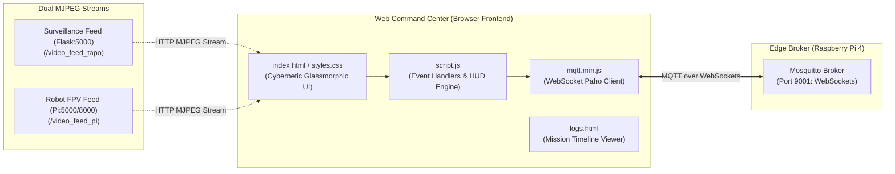

# 🎮 Web Command Center & Operator HUD

The **Phoenix Web Command Center** is a zero-install, responsive cybernetic command-and-control interface designed for real-time mission oversight, video stream inspection, telemetry logging, and direct manual piloting.

---

## 🖥️ Command Center Architecture



---

## 🎨 Design System & UI Components

The interface employs a high-contrast dark sci-fi aesthetic engineered for situational awareness in field conditions:

* **Color Palette:**
  - `Fire Accent (--fire)`: `#ff4f1a` (flame alerts, water suppression indicators).
  - `OK / Ready (--ok)`: `#00e5a0` (system nominal, connected, target reached).
  - `Warning (--warn)`: `#ffb340` (navigation active, obstacle proximity).
  - `Danger (--danger)`: `#ff2d2d` (emergency stop, casualty detected).
  - `Life Accent (--human)`: `#c084fc` (human & fall detection markers).
* **Typography:** `Share Tech Mono` for numerical coordinates and telemetry gauges; `Barlow` / `Barlow Condensed` for tactical headings.
* **Audio Feedback:** Real-time synthesized audio feedback for button interactions, fire alerts, and connection state transitions.

---

## 🎛️ Dashboard Panels & Interactive Features

### 1. Dual-Camera Tactical HUD
* **Surveillance Overview:** Displays the wide-angle arena camera feed with bounding boxes around detected fires, human targets, and ArUco marker pose coordinates.
* **FPV Pilot Cam:** Displays the robot's forward camera stream for precise alignment during water suppression.
* **Stream Fallbacks:** Built-in connection check with automatic reconnection and fallback indicators if a camera stream drops.

### 2. Live Telemetry & Mission State
* **Status Pill:** Visual mission state (`IDLE`, `NAVIGATING`, `TARGET_REACHED`, `MANUAL_OVERRIDE`).
* **Coordinates Gauge:** Real-time $X$ and $Y$ goal coordinates in meters relative to the map origin.
* **Network Monitor:** Live WebSocket connection status, heartbeat indicator, and broker ping latency.

### 3. Mission Control & Actuator Interface
* **Mode Switcher:** Instant toggling between `AUTONOMOUS` mode (Nav2 AI navigation) and `MANUAL` mode (Operator override).
* **Drive Controls:** Dual-mode manual locomotion using a virtual analog joystick or a 4-way tactical D-Pad.
* **Gimbal Directional Pad:** 4-axis panning/tilting controls with speed tuning and single-click `CENTER` alignment.
* **Suppression Cannon Trigger:** Tactile hold-to-spray fire button with visual pulse animation, automatically sending `ON` on press and `OFF` on release.

---

## ⚙️ Quick Connection Setup

1. Open `Phoenix_Web_Command_Center/index.html` in Chrome, Firefox, Safari, or Edge.
2. Navigate to the **⚙ Settings** tab on the dashboard.
3. Enter the WebSocket URI for your Raspberry Pi:
   ```
   ws://192.168.1.XX:9001/mqtt
   ```
4. Click **⚡ CONNECT TO BROKER**. The connection pill will glow green (`ONLINE`).
5. Open `logs.html` anytime to review full chronological operational event timestamps.
